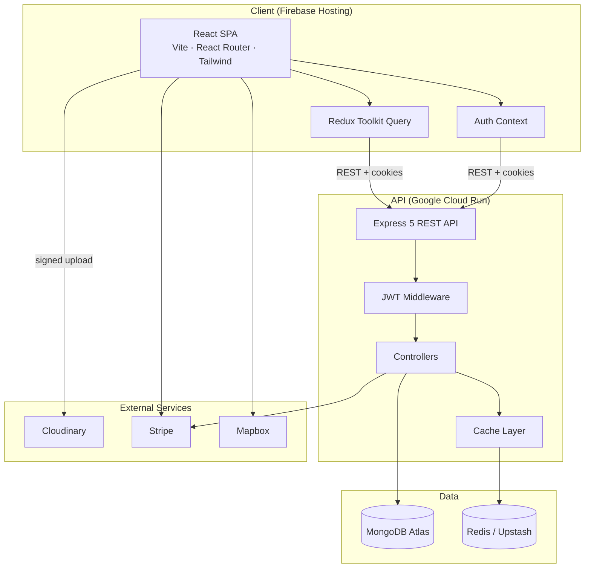
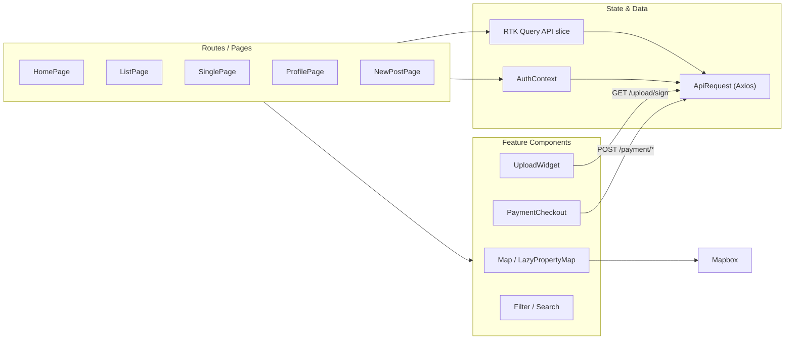
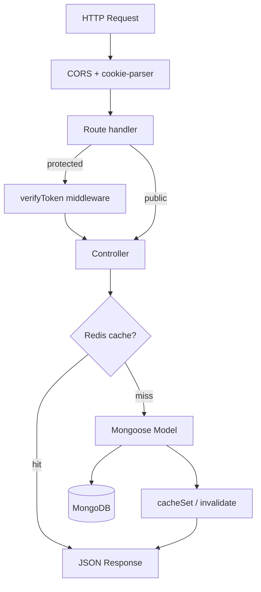
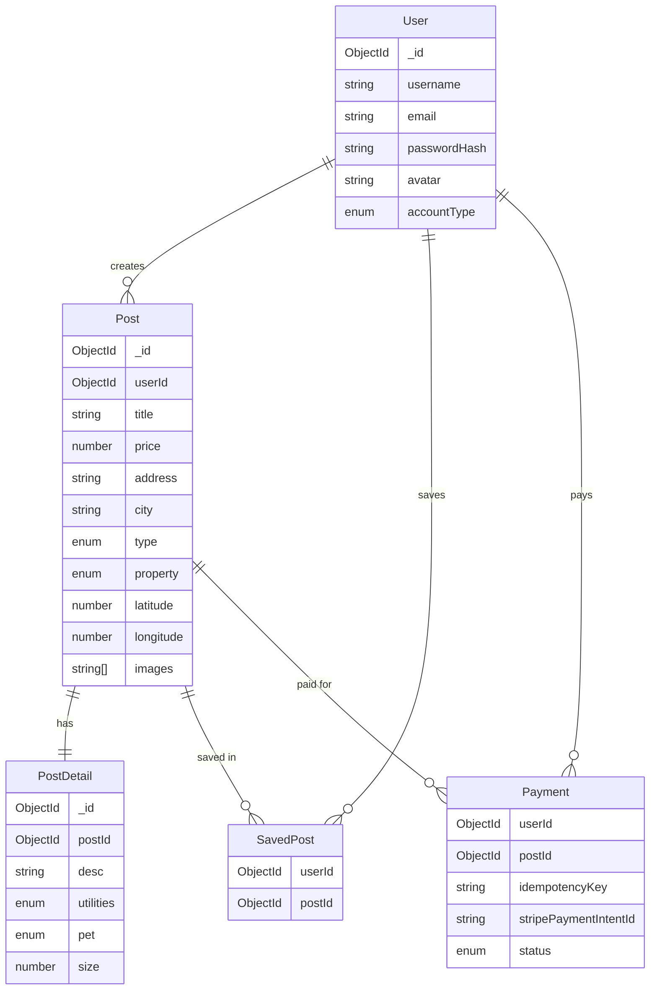
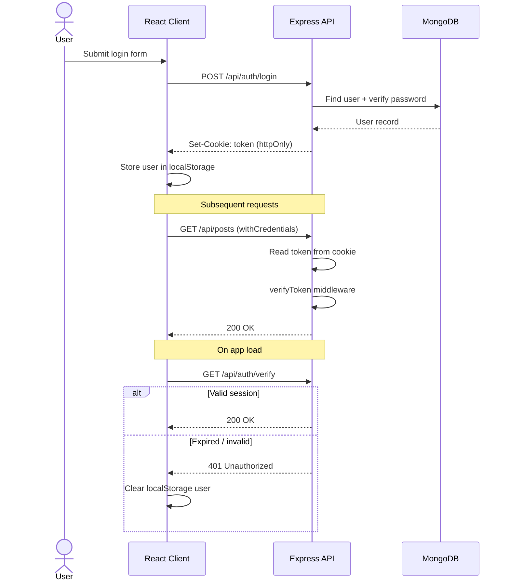
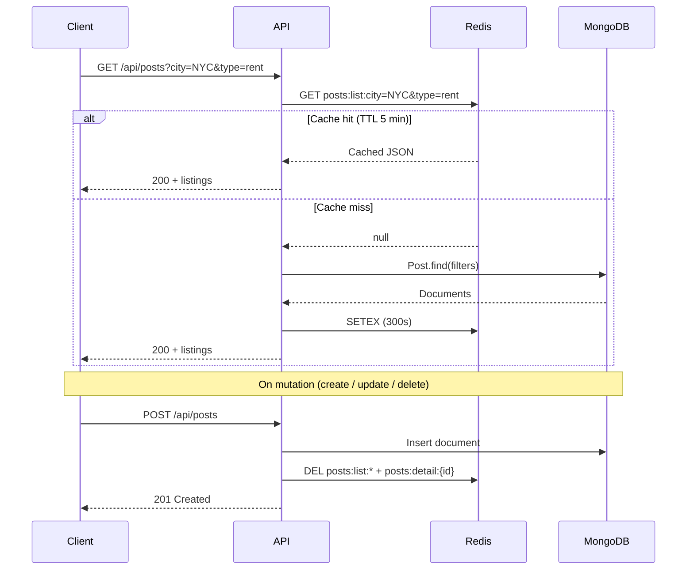
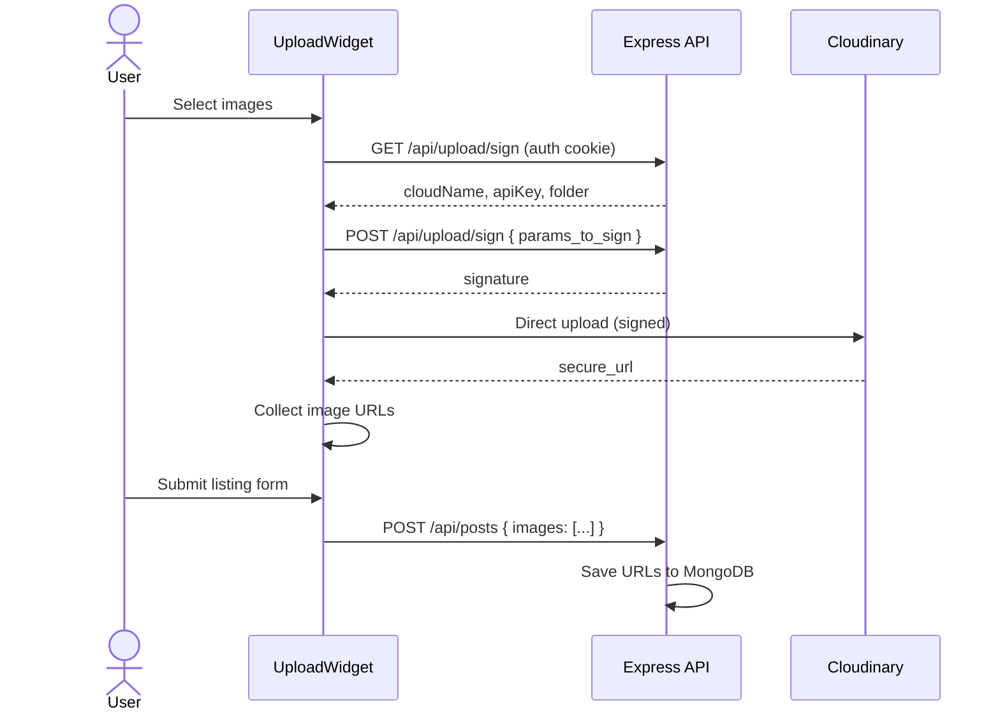
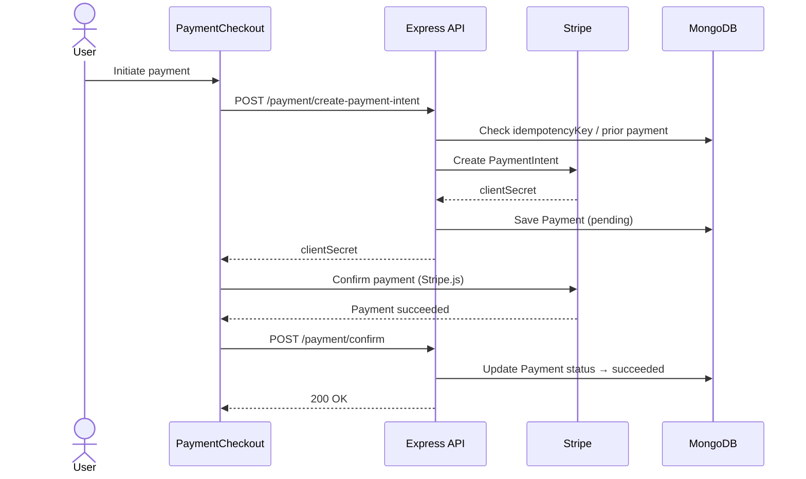
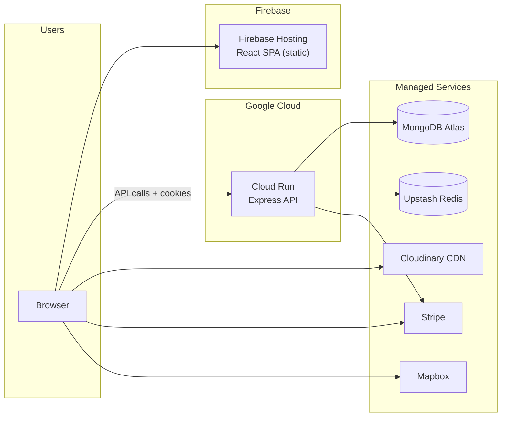

# CrestKeys

<div align="center">


**A full-stack real estate platform for browsing, listing, and booking properties**

[](https://opensource.org/licenses/MIT)
[](https://nodejs.org/)
[](https://react.dev/)
[](https://www.typescriptlang.org/)
[](https://www.mongodb.com/)

[Live demo](https://crestkeys.web.app) · [Report a bug](https://github.com/your-username/crestkeys/issues)

</div>

---

## Overview

CrestKeys connects property owners, buyers, renters, and vacation guests through a modern listing experience. Users can search and filter listings on an interactive map, save favorites, manage profiles, create listings with rich media, and complete payments for eligible properties via Stripe.

| Audience | What they can do |
| --- | --- |
| **Buyers & renters** | Search listings, filter by type and amenities, save favorites, view details on a map |
| **Property owners** | Create and manage listings, upload photos, track saved interest |
| **Agents** | Register as an agent account type and showcase properties |
| **Guests** | Browse public listings; sign in to save, list, or pay |

## Screenshots

<div align="center">
  <table>
    <tr>
      <td width="50%">
        
      </td>
      <td width="50%">
        
      </td>
    </tr>
    <tr>
      <td width="50%">
        
      </td>
      <td width="50%">
        
      </td>
    </tr>
    <tr>
      <td width="50%">
        
      </td>
      <td width="50%">
        
      </td>
    </tr>
    <tr>
      <td colspan="2" align="center">
        
      </td>
    </tr>
  </table>
</div>

## Features

- **Property search & filters** — Browse buy, rent, and vacation listings with price, location, and amenity filters
- **Interactive maps** — Mapbox and Leaflet views for exploring neighborhoods
- **User accounts** — Registration with account types (`owner`, `buyer`, `agent`, `admin`) and HTTP-only cookie auth
- **Listing management** — Create, edit, and delete property listings with rich descriptions (TipTap editor)
- **Direct Cloudinary uploads** — Signed browser uploads so media never transits the API
- **Saved properties** — Bookmark listings from the profile dashboard
- **Stripe payments** — Secure checkout flow for eligible property transactions
- **Redis caching** — TTL-backed cache on hot read paths with automatic invalidation on writes

## Tech stack

| Layer | Technologies |
| --- | --- |
| **Frontend** | React 19, TypeScript, Vite, Tailwind CSS, Redux Toolkit Query, React Router, React Hook Form, Zod, Framer Motion |
| **Backend** | Node.js 22, Express 5, TypeScript, Mongoose, JWT (jose), bcrypt |
| **Data & cache** | MongoDB Atlas, Redis (optional, via Upstash or similar) |
| **Services** | Cloudinary (media), Stripe (payments), Mapbox (maps) |
| **Deployment** | Firebase Hosting (client), Google Cloud Run (API), Docker |

## Architecture

CrestKeys is a **decoupled SPA + REST API** architecture. The React client talks to the Express API over HTTPS with credentials (cookies). Third-party services handle media, payments, and maps so the API stays focused on business logic and data.

### System overview



### Client architecture

The frontend is a single-page application with two complementary state layers:

| Layer | Role |
| --- | --- |
| **Redux Toolkit Query** (`client/src/state/api.ts`) | Server state — listings, user profiles, cached API responses |
| **Auth Context** (`client/src/context/`) | Session state — current user, route guards, session verification on load |
| **Axios client** (`client/src/lib/ApiRequest.ts`) | Shared HTTP client with `withCredentials: true` for cookie auth |



Protected routes (`/profile`, `/add`, `/profile/update`) are wrapped in a `RequireAuth` layout that redirects unauthenticated users to the login page.

### API architecture

The API follows a classic **routes → middleware → controllers → models** pattern:



| Route prefix | Controller | Purpose |
| --- | --- | --- |
| `/api/auth` | `auth.controller` | Register, login, logout, session verify |
| `/api/posts` | `post.controller` | CRUD for property listings |
| `/api/users` | `user.controller` | Profiles, saved posts |
| `/api/payment` | `payment.controller` | Stripe PaymentIntents |
| `/api/upload` | `upload.controller` | Cloudinary signing |
| `/api/verify` | `verify.controller` | Admin / role checks |

### Data model

MongoDB stores four core collections with references between them:



### Authentication flow

Sessions use a **JWT stored in an HTTP-only cookie**. User profile metadata is cached in `localStorage` for UI display; the cookie is the source of truth for authorization.



In cross-origin production (Firebase + Cloud Run), cookies are issued with `SameSite=None; Secure` when both `FRONTEND_URL` and `BACKEND_URL` are HTTPS.

### Property read path (with caching)

List and detail endpoints check Redis before hitting MongoDB. Writes invalidate matching cache keys.



| Cache key pattern | TTL | Invalidated on |
| --- | --- | --- |
| `posts:list:{query}` | 5 min | Any post create, update, or delete |
| `posts:detail:{id}` | 10 min | Update or delete of that post |

If `REDIS_URL` is unset or Redis is down, the API skips caching and reads directly from MongoDB.

### Image upload flow

Media never passes through the API server. The API only returns Cloudinary config and signs upload parameters.



### Payment flow

Stripe handles card data on the client via Elements. The API creates PaymentIntents and records status in MongoDB with idempotency keys to prevent duplicate charges.



### Deployment topology



| Component | Host | Notes |
| --- | --- | --- |
| React SPA | Firebase Hosting | Built with Vite; SPA rewrites in `firebase.json` |
| Express API | Google Cloud Run | Multi-stage Docker build from `api/Dockerfile` |
| Database | MongoDB Atlas | Primary data store |
| Cache | Upstash Redis | Optional; TLS via `rediss://` |
| Media | Cloudinary | Browser-direct uploads; URLs stored in MongoDB |
| Payments | Stripe | Server-side PaymentIntents; client-side Elements |
| Maps | Mapbox | Token injected via `VITE_MAPBOX_TOKEN` |

## Project structure

```text
crestkeys/
├── api/                    # Express REST API
│   ├── controllers/        # Route handlers (auth, posts, users, payments, uploads)
│   ├── middleware/         # JWT verification
│   ├── models/             # Mongoose schemas
│   ├── routes/             # API route definitions
│   ├── scripts/            # Seed, migration, and utility scripts
│   ├── utils/              # JWT, Redis, Cloudinary, Stripe, cache helpers
│   ├── index.ts            # Server entry point
│   └── Dockerfile          # Cloud Run / container build
│
└── client/                 # React SPA
    ├── src/
    │   ├── components/     # UI components (cards, map, upload widget, payment)
    │   ├── context/        # Auth context
    │   ├── lib/            # API client and utilities
    │   ├── routes/         # Page-level views
    │   └── state/          # Redux Toolkit Query API slice
    ├── firebase.json       # Firebase Hosting config
    └── vite.config.ts
```

## Prerequisites

- **Node.js 22+** and npm
- **MongoDB** database (Atlas recommended)
- **Cloudinary** account (for image uploads)
- **Mapbox** access token (for map views)
- **Stripe** keys (optional, for payment features)
- **Redis** URL (optional, enables response caching)

## Getting started

### 1. Clone the repository

```bash
git clone https://github.com/your-username/crestkeys.git
cd crestkeys
```

### 2. Configure the API

```bash
cd api
cp .env.example .env
npm install
```

Edit `api/.env`:

| Variable | Required | Description |
| --- | --- | --- |
| `PORT` | No | API port (default `5000`) |
| `FRONTEND_URL` | Yes | Client origin for CORS and cookies (e.g. `http://localhost:5173`) |
| `BACKEND_URL` | Yes | Public API URL (e.g. `http://localhost:5000`) |
| `JWT_SECRET_KEY` | Yes | Secret for signing auth tokens |
| `MONGO_URI` | Yes | MongoDB connection string |
| `CLOUDINARY_CLOUD_NAME` | Yes | Cloudinary cloud name |
| `CLOUDINARY_API_KEY` | Yes | Cloudinary API key |
| `CLOUDINARY_API_SECRET` | Yes | Cloudinary API secret |
| `STRIPE_SECRET_KEY` | For payments | Stripe secret key |
| `REDIS_URL` | No | Redis connection string; caching disabled when unset |

> **Windows / Node 22:** Prefer a standard MongoDB connection string over SRV if you hit `querySrv ECONNREFUSED`. See comments in `api/.env.example`.

Start the API:

```bash
npm run dev
```

The server runs at `http://localhost:5000`.

### 3. Configure the client

```bash
cd ../client
cp .env.example .env
npm install
npm run dev
```

Edit `client/.env`:

| Variable | Required | Description |
| --- | --- | --- |
| `VITE_API_BASE_URL` | Yes | API base URL (e.g. `http://localhost:5000/api`) |
| `VITE_FRONTEND_URL` | Yes | Client URL (e.g. `http://localhost:5173`) |
| `VITE_MAPBOX_TOKEN` | Yes | Mapbox public token |
| `VITE_STRIPE_PUBLISHABLE_KEY` | For payments | Stripe publishable key |

Open `http://localhost:5173` in your browser.

### 4. Seed sample data (optional)

From the `api` directory:

```bash
npm run seed:posts        # Seed a small set of listings
npm run seed:posts:bulk   # Seed 100 listings
```

## Available scripts

### API (`api/`)

| Script | Description |
| --- | --- |
| `npm run dev` | Start dev server with hot reload |
| `npm run build` | Compile TypeScript to `dist/` |
| `npm start` | Run production build |
| `npm run seed:posts` | Seed sample property listings |
| `npm run seed:posts:bulk` | Seed 100 listings |
| `npm run migrate:images` | Migrate local images to Cloudinary |
| `npm run upload:portraits` | Upload testimonial portrait assets |

### Client (`client/`)

| Script | Description |
| --- | --- |
| `npm run dev` | Start Vite dev server |
| `npm run build` | Type-check and build for production |
| `npm run preview` | Preview production build locally |
| `npm run lint` | Run ESLint |

## Authentication

CrestKeys uses JWT tokens stored in **HTTP-only cookies** for session management.

1. **Register** — `POST /api/auth/register` with username, email, password, and `accountType`
2. **Login** — `POST /api/auth/login` sets an auth cookie
3. **Session check** — `GET /api/auth/verify` validates the current session
4. **Logout** — `POST /api/auth/logout` clears the cookie
5. **Protected routes** — Client routes under `/profile`, `/add`, etc. require authentication; API middleware rejects unauthenticated requests

In production with separate frontend and API domains, cookies use `SameSite=None; Secure` automatically when both URLs are HTTPS.

## Image uploads

Images upload **directly from the browser to Cloudinary** — the API only signs requests:

1. Authenticated client requests upload credentials from `GET /api/upload/sign`
2. Browser uploads files directly to Cloudinary
3. Returned URLs are saved with the property listing

This keeps media off the API server and reduces bandwidth costs.

## Performance

Hot read paths (`GET /api/posts`, `GET /api/posts/:id`) are cached in Redis with TTL-based expiry. Cache entries are invalidated on create, update, and delete. When Redis is unavailable, the API falls back to direct MongoDB reads.

Set `REDIS_URL` in the API environment to enable caching.

## API reference

Base URL: `/api`

### Authentication

| Method | Endpoint | Auth | Description |
| --- | --- | --- | --- |
| `POST` | `/auth/register` | No | Create a new account |
| `POST` | `/auth/login` | No | Sign in |
| `POST` | `/auth/logout` | No | Sign out |
| `GET` | `/auth/verify` | Yes | Verify current session |

### Users

| Method | Endpoint | Auth | Description |
| --- | --- | --- | --- |
| `GET` | `/users/profilePosts` | Yes | Get current user's listings and saved posts |
| `GET` | `/users/:id` | Yes | Get user by ID |
| `PUT` | `/users/:id` | Yes | Update user profile |
| `DELETE` | `/users/:id` | Yes | Delete user account |
| `POST` | `/users/save` | Yes | Save or unsave a listing |

### Properties

| Method | Endpoint | Auth | Description |
| --- | --- | --- | --- |
| `GET` | `/posts` | No | List properties (supports query filters) |
| `GET` | `/posts/:id` | No | Get property details |
| `POST` | `/posts` | Yes | Create a listing |
| `PUT` | `/posts/:id` | Yes | Update a listing |
| `DELETE` | `/posts/:id` | Yes | Delete a listing |

### Payments

| Method | Endpoint | Auth | Description |
| --- | --- | --- | --- |
| `POST` | `/payment/create-payment-intent` | Yes | Create a Stripe PaymentIntent |
| `POST` | `/payment/confirm` | Yes | Confirm payment completion |

### Uploads

| Method | Endpoint | Auth | Description |
| --- | --- | --- | --- |
| `GET` | `/upload/sign` | Yes | Get Cloudinary upload config |
| `POST` | `/upload/sign` | Yes | Sign upload parameters |

## Deployment

### Frontend (Firebase Hosting)

```bash
cd client
npm run build
firebase deploy --only hosting
```

The built SPA is served from `client/dist` with SPA rewrites configured in `firebase.json`.

### Backend (Google Cloud Run)

Build and deploy from the `api` directory using the included Dockerfile:

```bash
cd api
docker build -t crestkeys-api .
# Push to your registry and deploy to Cloud Run
```

Set environment variables in Cloud Run (or via a secrets manager). Ensure `FRONTEND_URL` and `BACKEND_URL` match your deployed domains so CORS and cookies work correctly.

### Docker (API only)

```bash
cd api
docker build -t crestkeys-api .
docker run -p 5000:5000 --env-file .env crestkeys-api
```

See [README.Docker.md](./README.Docker.md) for additional Docker notes.

## Environment checklist for production

- [ ] MongoDB Atlas cluster with network access configured
- [ ] `JWT_SECRET_KEY` set to a strong random value
- [ ] Cloudinary credentials configured
- [ ] `FRONTEND_URL` and `BACKEND_URL` set to production HTTPS URLs
- [ ] Mapbox token set in client env
- [ ] Stripe keys set (if using payments)
- [ ] Redis URL set (recommended for performance)

## Contributing

Contributions are welcome. Please open an issue first for large changes so we can align on approach.

1. Fork the repository
2. Create a feature branch (`git checkout -b feature/my-feature`)
3. Commit your changes
4. Open a pull request

## License

This project is licensed under the [MIT License](https://opensource.org/licenses/MIT).
